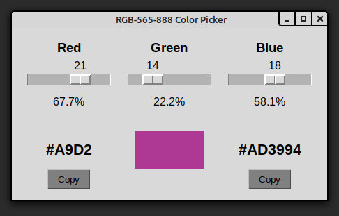

# RGB565-Color-Picker_Python-GUI

Credit to [hamaluik](https://github.com/hamaluik/TFTColour) whose work helped me understand the bitwise operators I needed to implement this.

This is a small Tkinter GUI for selecting RGB565 colors. RGB565 is a subset of the more common RGB888 palette. It's often used when memory is at a premium because these colors only require 16 bits (5 + 6 + 5) rather than the typical 24 bits (8 + 8 + 8).

Unlike a lot of online color pickers, this application doesn't find an RGB888 value and round to the nearest RGB565 value. It snaps to each available R/G/B channel value so you'll see exactly 65,536 possible colors. Notice the 6 in 565 is the green channel. This is because the human eye can see shades of green more efficiently than red or blue, so it's allotted the extra bit.

Simply drag the red, green, and blue sliders. The GUI generates both RGB565 and RGB888 color codes. There are `Copy` buttons to copy them to your clipboard.

